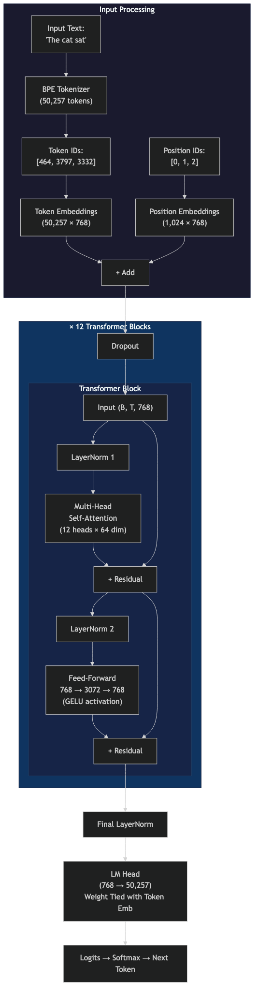

# 01 — GPT-2 From Scratch

> **Difficulty:** ⭐⭐ | **Time to run:** 5 min | **GPU required:** No

GPT-2 is the architecture behind every major LLM — GPT-4, Claude, Llama, DeepSeek. This week I implemented all 124M parameters from scratch in PyTorch, loaded the real OpenAI weights, and verified it generates text identically to HuggingFace.

## Key Takeaways

1. **Self-attention is a learned lookup table** — Q, K, V matrices learn which tokens to attend to. Nobody programs these patterns.
2. **The 1/√d scaling isn't optional** — remove it and the model produces garbage even with correct weights loaded.
3. **GPT-2 → GPT-4 is evolution, not revolution** — same core (attention + FFN + residuals), better training and scale.
4. **Weight tying is elegant** — the token embedding matrix IS the output head (transposed). Understanding a word and predicting a word share the same representation.

## Architecture

```
Input → [Token Embed + Position Embed] → Dropout
  → 12× [LayerNorm → Multi-Head Attention → + Residual → LayerNorm → FFN → + Residual]
  → LayerNorm → LM Head → Next Token Probabilities
```

| Component | Dimensions | Purpose |
|-----------|-----------|---------|
| Token Embedding | 50,257 × 768 | Word → vector |
| Position Embedding | 1,024 × 768 | Encode word order |
| Attention (per head) | Q,K,V: 768 → 64 | "What should I attend to?" |
| FFN | 768 → 3,072 → 768 | "What do I do with this info?" |
| LM Head | 768 → 50,257 | Vector → next word probabilities |



## Quick Start

```bash
cd code
python -m venv .venv && source .venv/bin/activate
pip install -r requirements.txt

# Generate text
python gpt2.py --prompt "The future of AI is" --max_tokens 80

# Visualize what attention heads learn
python gpt2.py --visualize --viz_text "The cat sat on the mat"

# Try different layers — early layers learn position, late layers learn meaning
python gpt2.py --visualize --viz_text "The CEO told the engineer to fix the bug" --viz_layer 11 --viz_head 5
```

## Experiments to Try

| Experiment | Command | What You'll Learn |
|-----------|---------|-------------------|
| Low temperature | `--temperature 0.3` | More deterministic, repetitive output |
| High temperature | `--temperature 1.5` | More creative, sometimes incoherent |
| No top-k | `--top_k 0` | Full vocabulary sampling (more random) |
| Compare attention layers | `--visualize --viz_layer 0` vs `--viz_layer 11` | Early = positional, Late = semantic |
| Long generation | `--max_tokens 200` | See where GPT-2 starts losing coherence |

## How the Math Works

### Self-Attention (the core mechanism)

```
For each token:
  Q = input × W_Q    → "What am I looking for?"
  K = input × W_K    → "What do I contain?"
  V = input × W_V    → "What info do I carry?"

  Scores = Q × K^T / √64       → similarity between tokens
  Scores = causal_mask(Scores)  → can't see future tokens
  Weights = softmax(Scores)     → normalize to probabilities
  Output = Weights × V          → weighted mix of values
```

12 heads run in parallel (each with 64 dimensions), learning different patterns:
- **Positional heads**: attend to previous/next token
- **Syntactic heads**: attend to subject of the sentence
- **Semantic heads**: attend to topically related words

### Why This Architecture Scaled to GPT-4

| Design Choice | Why It Works |
|--------------|-------------|
| Residual connections | Gradients flow through 12+ layers without vanishing |
| Pre-norm (LayerNorm before attention) | Stable training at any scale |
| Weight tying | Fewer params, better representations |
| Decoder-only | Simpler than encoder-decoder, just predict next token |

## What Changed in Modern LLMs

| | GPT-2 (2019) | Modern (2025+) |
|---|---|---|
| Position encoding | Learned absolute | RoPE (relative, extrapolates beyond training length) |
| Attention | Full, all heads independent | GQA/MQA (shared K,V across heads — less memory) |
| FFN activation | GELU | SwiGLU (better gradient flow) |
| Normalization | LayerNorm | RMSNorm (faster, no mean computation) |
| Architecture | Dense | Dense or MoE (Mixture of Experts) |
| Context | 1,024 tokens | 128K – 1M+ |

These are **optimizations**, not reinventions. The core loop — attention + FFN + residual — is identical.

## When Would You Use GPT-2?

**You wouldn't in production.** But understanding GPT-2 means you understand:
- Why Claude is good at long documents (attention + context length)
- Why Mixtral is cheaper (MoE = sparse activation of the FFN layer)
- Why quantization works (weights are redundant, can be compressed)
- Why agents hallucinate (attention assigns weight to irrelevant context)

---

**Full write-up**: [DEEP-DIVE.md](DEEP-DIVE.md)  
**Blog (publish-ready)**: [blog/week-01-gpt2-from-scratch.md](../../blog/week-01-gpt2-from-scratch.md)  
**Animated explainer**: open [explainer/index.html](explainer/index.html) in a browser  
**Social copy**: [social/linkedin.md](social/linkedin.md) · [social/x.md](social/x.md)
